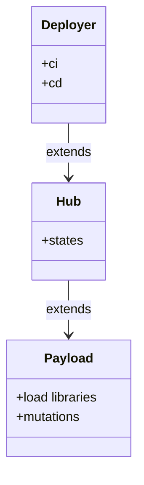

# CICD

1. The build library provides a set of methods for building and deployment.
0. The builder is implemented based on the Payload utility.

# Class diagram

```mermaid
classDiagram
    
    class Deployer {
        +ci
        +cd
    }

    class Hub {
        +states
    }

    class Payload {
        +load libraries
        +mutations
    }

    Deployer --> Hub : extends
    Hub --> Payload : extends
```
